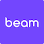

One of the better ways to explore a new city is by bike, because you can take as much time as you like, stop wherever something catches your eye, and get a real perspective of life in Brisbane.

Brisbane is a great city for cycling because the city centre is ringed with bike paths, and there are two dockless bike and scooter share schemes in the city.



## 🚲 Bike share (and scooters too!)

Before heading out, you should download and sign up to both [Neuron](https://www.rideneuron.com/) and [Beam](https://www.ridebeam.com/).

Subscription is free, and you can see a map of all the bikes and scooters available to hire in your area.

## 💰 Free trips

Use my signup code to get free credit on hire bikes.

  

    

      

        
      

      

        <h3> Neuron signup code</h3>
        
Grab a free 10 minute ride with this code:

        <aside class="copy-code">
          <code id="neuron-code" class="copy-code__text">9FMZ25GQ</code>
          <button class="copy-code__button" data-clipboard-target="#neuron-code">
          Copy code
          </button>
        </aside>
      

    

  

  

    

      

      

      

        <h3>Beam signup code</h3>
        
Get $3 free credit using this code:

        <aside class="copy-code">
          <code id="beam-code" data-owner="ash" class="copy-code__text">mR5gVvs</code>
          <!-- code id="beam-code" data-owner="tae" class="copy-code__text">Az3rHAN</code -->
          <button class="copy-code__button" data-clipboard-target="#beam-code">
          Copy code
          </button>
        </aside>
      

    

  



## 🤑 Life hack: get a day pass

Beam and Neuron aren't exactly cheap. If you're doing anything more than a quick scoot, a daily or weekly pass is much better value.

- **BEAM**: A _Universal Pass_ on Beam will set you back $15 for a day, or $33 for a week. This includes free unlocks and 120 minutes per day. There is no monthly option, and you may only use the pass [in the city where you bought it](https://support.ridebeam.com/en/articles/6795893-am-i-able-to-use-my-pass-in-other-cities).
- **Neuron**: The _Neuron Pass_ costs $15 for a day, $33 for a week, or $99 for 30 days. This includes free unlocks, and 90 minutes of rides per day. As an extra benefit you can use this pass in any other Australian city too.

While this sounds like a lot of money, a couple of trips can easily exceed the price of a daily pass so it often works out cheaper to just get one.

## Video: What's it like riding in Brisbane?

<iframe width="560" height="315" src="https://www.youtube-nocookie.com/embed/K8-k3Qt0sLw" title="YouTube video player" frameborder="0" allow="accelerometer; autoplay; clipboard-write; encrypted-media; gyroscope; picture-in-picture; web-share" allowfullscreen></iframe>

## 🪖 Wear a helmet

Australian law requires you wear a helmet at all times while you ride a bicycle. This is strictly enforced and the fines are quite steep, so don't risk it.

There are usually helmets provided on the bikes, although occasionally it may be damaged or missing.

There will usually be another bike nearby with a helmet, so check around. You can also buy a cheap helmet for under $25 from department stores like Big W or Target in an emergency.

Check out more [rules on riding bikes](/bicycle-regulation).

## 🚲 The old CityCycles

CityCycle was the old bike hire scheme, which opened in 2010 and was retired in 2021.

If you're interested in a little look back through memory lane, check my [CityCycle history and eulogy](https://ash.ms/2022/01/30/brisbane-citycycle/) (off site).
