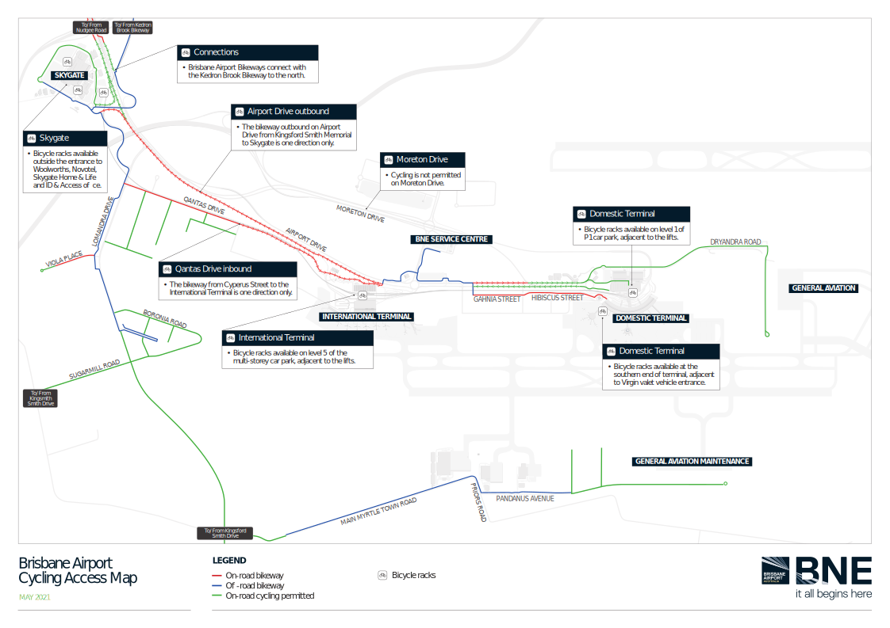

## Riding to DFO

You can get to DFO, the Woolworths and Airport Village by bike very comfortably.

A dedicated cycleway runs from Nudgee Road at Schulz canal (near the Jim Soorley bikeway), then connects to the overpass over Airport Drive.

## Riding to the Brisbane Airport

If you want to ride a bike to Brisbane Airport you'll need to be confident with on-road cycling. The official route is different depending on whether you're inbound or outbound.

Heading toward the airport, you'll need to take a more circuitous route along Qantas Drive to avoid several dangerous crossings. Heading outbound you can just take Airport Drive most of the way.

The following map from Brisbane Airport shows the recommended routes:

Bike parking and showers are available at both terminals.

- International terminal bike racks are on level 5 of the parking garage, beside the lift.
- Domestic termainal bike racks are on level 1 of the P1 car park, near the lifts.

For the most up to date information on getting to the Brisbane Airport, check the [The BAC Website](https://www.bne.com.au/passenger/to-and-from/transport-options).
